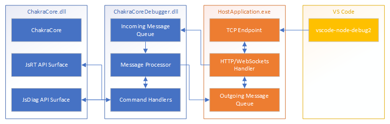
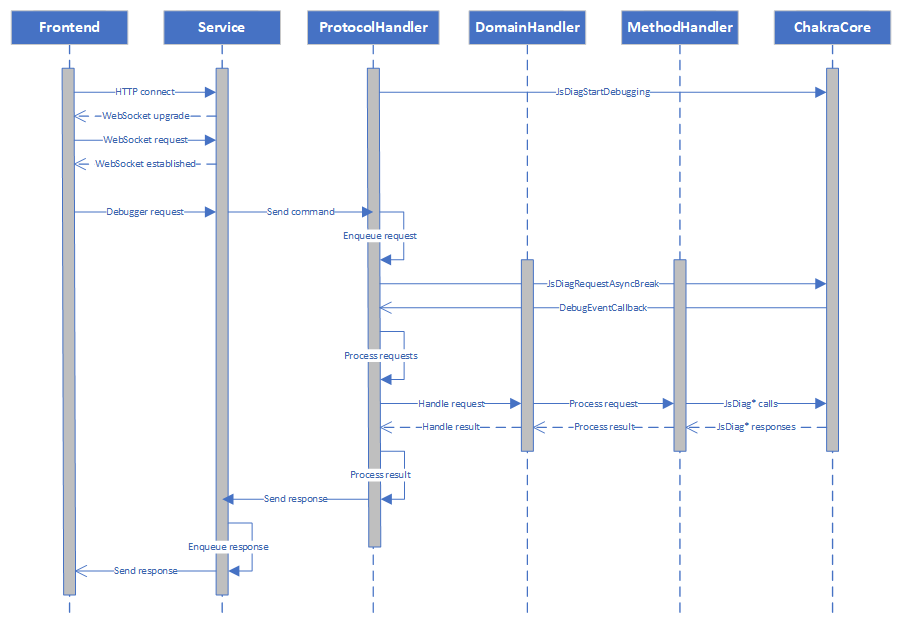
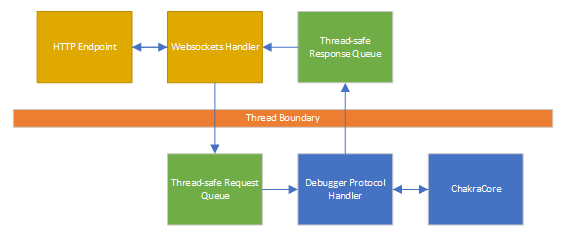

# ChakraCore Debugger Companion

## Overview
There's currently no turn-key way to debug ChakraCore-embedded scenarios. It's possible to write a debugger using the
JsDiag* API surface, but it's non-trivial to leverage any existing debugging tools. This feature aims to provide an
end-to-end flow for debugging the scripts running within ChakraCore in a host application. The focus is on debugging
using VS Code, but since the implementation uses the CrDP protocol it should be compatible with other debuggers as well.

  
*Figure 1: High level overview of the components*

This still doesn't provide a completely turn-key solution but implements all the components which complete the flow
while allowing the embedder to customize them as needed for their application.

## Detailed Design
The design consists of two major components, the `JsDebugProtocolHandler` and the `JsDebugService`. The design is such
that there is a clear boundary between the two components and any implementer can provide their own `JsDebugService`
instance that conforms to the API. The `JsDebugService` will be capable of binding to a given port number and providing
debugger connectivity for one or more `JsDebugProtocolHandler` instances.

  
*Figure 2: Sequence of operations for processing a debugger command*

### Threading Model
Debugging operations are all handled on the main engine thread (whichever thread is currently executing the script).
Requests from the frontend are received on a secondary thread which places them into a thread-safe queue and then calls
JsRequestAsyncBreak on the engine. Once the engine has processed the incoming request (generated any outgoing events),
they will be placed in a thread-safe outbound queue and the handler will pick them up and send them to the frontend.

  
*Figure 3: Threading model for the components*

### Debug Protocol Handler
The primary job of the protocol handler is to collect messages from the host and process them sequentially. All messages
are in the form of JSON objects and will be placed in a thread-safe queue. There is a one-to-one connection between a
`JsRuntime` and a `JsDebugProtocolHandler` instance, but a single process can host multiple simultaneous instances of
each.

#### API Surface

```cpp
typedef struct JsDebugProtocolHandler__ *JsDebugProtocolHandler;
typedef void(CHAKRA_CALLBACK *JsDebugProtocolHandlerSendResponseCallback)(const char *response);

/// <summary>Creates a <seealso cref="JsDebugProtocolHandler" /> instance for a given runtime.</summary>
/// <remarks>
///     It also implicitly enables debugging on the given runtime, so it will need to only be done when the engine is
///     not currently running script. This should be called before any code has been executed in the runtime.
/// </remarks>
/// <param name="runtime">The runtime to debug.</param>
/// <param name="protocolHandler">The newly created instance.</param>
/// <returns>The code <c>JsNoError</c> if the operation succeeded, a failure code otherwise.</returns>
CHAKRA_API JsDebugProtocolHandlerCreate(JsRuntimeHandle runtime, JsDebugProtocolHandler* protocolHandler);

/// <summary>Destroys the instance object.</summary>
/// <remarks>
///     It also implicitly disables debugging on the given runtime, so it will need to only be done when the engine is
///     not currently running script.
/// </remarks>
/// <param name="protocolHandler">The instance to destroy.</param>
/// <returns>The code <c>JsNoError</c> if the operation succeeded, a failure code otherwise.</returns>
CHAKRA_API JsDebugProtocolHandlerDestroy(JsDebugProtocolHandler protocolHandler);

/// <summary>Connect a callback to the protocol handler.</summary>
/// <remarks>
///     Any events that occurred before connecting will be queued and dispatched upon successful connection.
/// </remarks>
/// <param name="protocolHandler">The instance to connect to.</param>
/// <param name="breakOnNextLine">Indicates whether to break on the next line of code.</param>
/// <param name="callback">The response callback function pointer.</param>
/// <param name="state">The state object to return on each invocation of the callback.</param>
/// <returns>The code <c>JsNoError</c> if the operation succeeded, a failure code otherwise.</returns>
CHAKRA_API JsDebugProtocolHandlerConnect(
    JsDebugProtocolHandler protocolHandler,
    bool breakOnNextLine,
    JsDebugProtocolHandlerSendResponseCallback callback,
    void* state);

/// <summary>Disconnect from the protocol handler and clear any breakpoints.</summary>
/// <param name="protocolHandler">The instance to disconnect from.</param>
/// <returns>The code <c>JsNoError</c> if the operation succeeded, a failure code otherwise.</returns>
CHAKRA_API JsDebugProtocolHandlerDisconnect(JsDebugProtocolHandler protocolHandler);

/// <summary>Send an incoming JSON-formatted command to the protocol handler.</summary>
/// <remarks>
///     The response will be returned asynchronously.
/// </remarks>
/// <param name="protocolHandler">The receiving protocol handler.</param>
/// <param name="command">The JSON-formatted command to send.</param>
/// <returns>The code <c>JsNoError</c> if the operation succeeded, a failure code otherwise.</returns>
CHAKRA_API JsDebugProtocolHandlerSendCommand(JsDebugProtocolHandler protocolHandler, const char* command);
```

#### Dependencies
* Basic synchronization (mutex)

#### Message Processing

All messages within the protocol are in the form of JSON strings. There are a couple of options for dealing with these
strings:
* Use a native JSON parser library (possibly using the C++ REST SDK for this).
* Use ChakraCore to parse/stringify JSON, either from JSRT calls or by running script in a separate context.

The most straightforward approach is to use ChakraCore to do the JSON processing. The results from the debugger are
already JsValueRef pointers anyway, so we can just work directly with them and then stringify the results to get the
final response payload.

### Platform Implementation
The platform needs to provide the network connection required for the frontend interface. The core technologies are HTTP
and WebSockets.

#### WebSockets
All inspector traffic is transmitted over WebSockets, with some basic HTTP documents to allow querying the processes
state and capabilities. Although Node.js implements their own WebSockets handshake, for this implementation WebSocket++
looks to be a good library for implementing the same requirements. It's currently used by the Microsoft C++ REST SDK so
there's precedent for its usage.

It depends on an underlying network transport library (their most popular seems to be Asio) to interact with the host
operating system, but includes all of the necessary pieces to upgrade an HTTP connection and build/parse the WebSocket
frames.

Although it claims to have basic HTTP support, its usage hasn't been investigated for this purpose. Roughly it looks
like it just supports passthrough of HTTP headers for further processing.

#### HTTP

The HTTP endpoint services some basic requests from the frontend:
* /json or /json/list
  * Returns a JSON object containing the debuggable endpoints
* /json/protocol
  * Returns a JSON object containing the current protocol specification
* /json/version
  * Returns a JSON object containing the current "Browser" version and "Protocol-Version"
* /json/activate/\<id\>
  * Unsure what the purpose is, Node.js just seems to return "Target activated" if it's already active or nothing
    otherwise.

These are basic GET requests and shouldn't require any complex parsing (HTTP headers for instance). It's not clear if
any of these should be forwarded to the protocol handler for responses, at the moment it seems like these are all
host-specific (except maybe the protocol).

#### API Surface

```cpp
typedef struct JsDebugService__ *JsDebugService;
typedef void(CHAKRA_CALLBACK *JsDebugServiceSendResponseCallback)(char *response);

/// <summary>Creates a <seealso cref="JsDebugProtocolHandler" /> instance.</summary>
/// <param name="service">The newly created instance.</param>
/// <returns>The code <c>JsNoError</c> if the operation succeeded, a failure code otherwise.</returns>
CHAKRA_API JsDebugServiceCreate(JsDebugService* service);

/// <summary>Destroys the instance object.</summary>
/// <param name="service">The instance to destroy.</param>
/// <returns>The code <c>JsNoError</c> if the operation succeeded, a failure code otherwise.</returns>
CHAKRA_API JsDebugServiceDestroy(JsDebugService service);

/// <summary>Register a handler instance with this service.</summary>
/// <param name="service">The service instance to register with.</param>
/// <param name="id">The ID of the handler (it must be unique).</param>
/// <param name="handler">The handler instance.</param>
/// <param name="breakOnNextLine">Indicates whether to break on the next line of code.</param>
/// <returns>The code <c>JsNoError</c> if the operation succeeded, a failure code otherwise.</returns>
CHAKRA_API JsDebugServiceRegisterHandler(
    JsDebugService service,
    const char* id,
    JsDebugProtocolHandler handler,
    bool breakOnNextLine);

/// <summary>Unregister a handler instance from this service.</summary>
/// <param name="service">The service instance to unregister from.</param>
/// <param name="id">The ID of the handler to unregister.</param>
/// <returns>The code <c>JsNoError</c> if the operation succeeded, a failure code otherwise.</returns>
CHAKRA_API JsDebugServiceUnregisterHandler(JsDebugService service, const char* id);

/// <summary>Start listening on a given port.</summary>
/// <param name="service">The service instance to listen with.</param>
/// <param name="port">The port number to listen on.</param>
/// <returns>The code <c>JsNoError</c> if the operation succeeded, a failure code otherwise.</returns>
CHAKRA_API JsDebugServiceListen(JsDebugService service, uint16_t port);

/// <summary>Stop listening and close any connections.</summary>
/// <param name="service">The service instance to close.</param>
/// <returns>The code <c>JsNoError</c> if the operation succeeded, a failure code otherwise.</returns>
CHAKRA_API JsDebugServiceClose(JsDebugService service);
```

## Code Layout and Packaging

### Debugger Protocol Handler

The debugger protocol handler only uses the public (but still experimental) API surface of ChakraCore. This allows some
flexibility in where the code should live:
* A separate repo which builds against the public interface of ChakraCore as an external dependency.
* As part of the existing ChakraCore repo where it can build against a given version of ChakraCore.

Since the debugger protocol handler will be tightly coupled with the (public, but experimental) interface of ChakraCore,
it makes sense for it to live alongside the ChakraCore version for which it was built. It's beyond the scope of this
project to try and support all older versions but going forward we will still want to innovate in the debugger space and
will not want to manage these changes externally. The code for the protocol handler will live inside of ChakraCore and
build a LIB (Debugger.ProtocolHandler.lib) and a DLL (Debugger.ProtocolHandler.dll).

Paths:
* \<root\>\core\lib\Debugger\ProtocolHandler\
  * Debugger.ProtocolHandler.vcxproj
  * DebuggerProtocolHandler.h
  * \<core implementation files\>
* \<root\>\core\bin\Debugger\ProtocolHandler\Debugger.ProtocolHandler.vcxproj
  * DebuggerProtocolHandler.def

The primary consumption will be via the DLL which will use only JSRT APIs to interact with the engine.

### Platform Implementation

Because of the third-party dependencies for this part of the code, it likely should not live alongside ChakraCore.

Possible locations:
* Chakra-Samples

### Sample Code

The sample code will combine ChakraCore, ChakraCore.DebuggerProtocolHandler, and ChakraCore.DebuggerPlatform along with
a basic code sample which loads JS and executes it.

## Work Items

### Debugger Protocol Handler

* Establish project structure and basic build (including cross platform)
* Stub out API interface
* Build processor/dispatcher logic
* Request parsing/response building
* Build command handler logic
  * Runtime
  * Debugger
  * Schema
  * Console
* Write test cases

### Platform Implementation

* Establish project structure and basic build (including cross platform)
* Build the HTTP/WebSockets endpoint
* Build the HTTP request handler code
* Build the protocol handler interface code
* Write test cases

### Documentation

* Add documentation for the JsDebugProtocolHandler* methods to the ChakraCore wiki
* Add documentation for building the DebuggerPlatform code
* Add documentation for using the DebuggerPlatform code

### Sample Code

* Create project which consumes the dependencies
* Use other samples to create a basic script loader with some rudimentary host functions
* Write test cases for the sample?
* Document the process of building and running the sample
